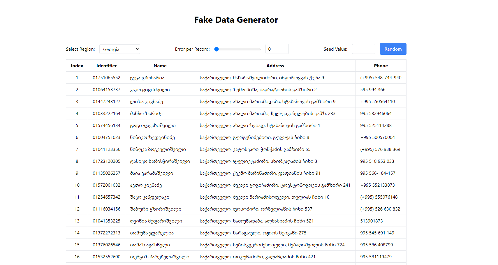

# Fake Data Generator

## Table of contents

- [Overview](#overview)
  - [The challenge](#the-challenge)
  - [Screenshot](#screenshot)
  - [Links](#links)
- [My process](#my-process)
  - [Built with](#built-with)
- [Author](#author)

## Overview

### The challenge

Users should be able to:

- Generate fake data such as name, personal id, adress, phone number
- set seed value, or generate random seed, website will have same result for same seed values,
-  scroll infinitly,
-  generate errors in data

### Screenshot

### Links

- Solution URL: [Add solution URL here](https://github.com/abramishvilisaba/user-data-generation)
- Live Site URL: [Add live site URL here](https://sabramishvili-fake-data-generation.netlify.app/)

## Author

- github - [saba abramishvili](github.com/abramishvilisaba)
